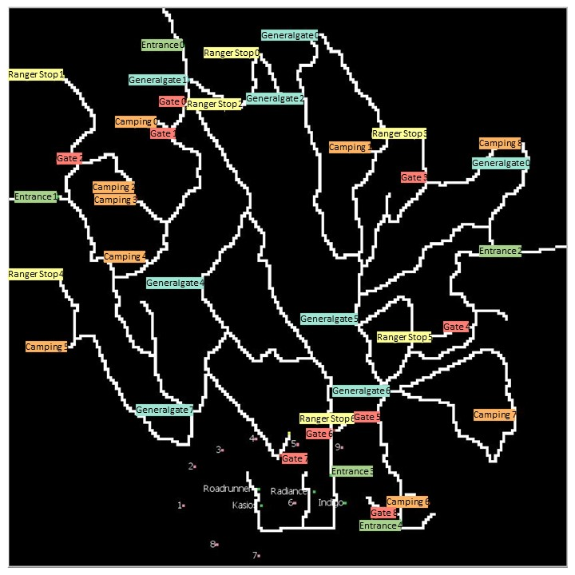

# Data Analysis and Visualisation
Project folder for DAV 
## VAST Challenge 2017 MC2
### introductionary text

With the passage of the Mistford Pact of 2010, the town and the Preserve have set into place certain safeguards to help ensure the safety of the people, animals, and vegetation of our area.  When Mistford began growing its manufacturing industry, both the town and the companies wished to ensure an environmentally sound and economically supportive partnership.  With these aims in mind, air sampling sensors have been placed near the town and in the Preserve to monitor air quality.  
These sensors collect information on several substances of potential concern, including:

----

- Appluimonia – An airborne odor is caused by a substance in the air that you can smell. Odors, or smells, can be either pleasant or unpleasant. In general, most substances that cause odors in the outdoor air are not at levels that can cause serious injury, long-term health effects, or death to humans or animals. However, odors may affect your quality of life and sense of well-being. Several odor-producing substances, including Appluimonia, are monitored under this program.   
- Chlorodinine – Corrosives are materials that can attack and chemically destroy exposed body tissues. Corrosives can also damage or even destroy metal. They begin to cause damage as soon as they touch the skin, eyes, respiratory tract, digestive tract, or the metal. They might be hazardous in other ways too, depending on the particular corrosive material. An example is the chemical Chlorodinine. It has been used as a disinfectant and sterilizing agent as well as other uses. It is harmful if inhaled or swallowed.
- Methylosmolene – This is a trade name for a family of volatile organic solvents. After the publication of several studies documenting the toxic side effects of Methylosmolene in vertebrates, the chemical was strictly regulated in the manufacturing sector. Liquid forms of Methylosmolene are required by law to be chemically neutralized before disposal.
- AGOC-3A – New environmental regulations, and consumer demand, have led to the development of low-VOC and zero-VOC solvents. Most manufacturers now use one or more low-VOC substances and Mistford’s plants have wholeheartedly signed on. These new solvents, including AGOC-3A, are less harmful to human and environmental health.

----
The Reserve is 
(12 miles)^2

he following are the factory locations:
- Roadrunner Fitness Electronics: 89,27
- Kasios Office Furniture: 90,21
- Radiance ColourTek: 109,26
- Indigo Sol Boards: 120,22

The following are the sensor locations:

Sensor | Location
--- | ---
1 | 62,21
2 |	66,35
3 | 76,41
4 |	88,45
5 |	103,43
6 |	102,22
7 |	89,3
8 |	74,7
9 |	119,42

### Main Questions

- Characterize the sensors’ performance and operation. Are they all working properly at all times? Can you detect any unexpected behaviors of the sensors through analyzing the readings they capture?Limit your response to no more than 9 images and 1000 words.
- Now turn your attention to the chemicals themselves. Which chemicals are being detected by the sensor group? What patterns of chemical releases do you see, as being reported in the data? Limit your response to no more than 6 images and 500 words.
- Which factories are responsible for which chemical releases? Carefully describe how you determined this using all the data you have available. For the factories you identified, describe any observed patterns of operation revealed in the data. Limit your response to no more than 8 images and 1000 words.

### Authors
De Gedreven Bois:
Angelo Groot, Hidde Jessen, Philip Kleinbrahm en Sven Boogmans
